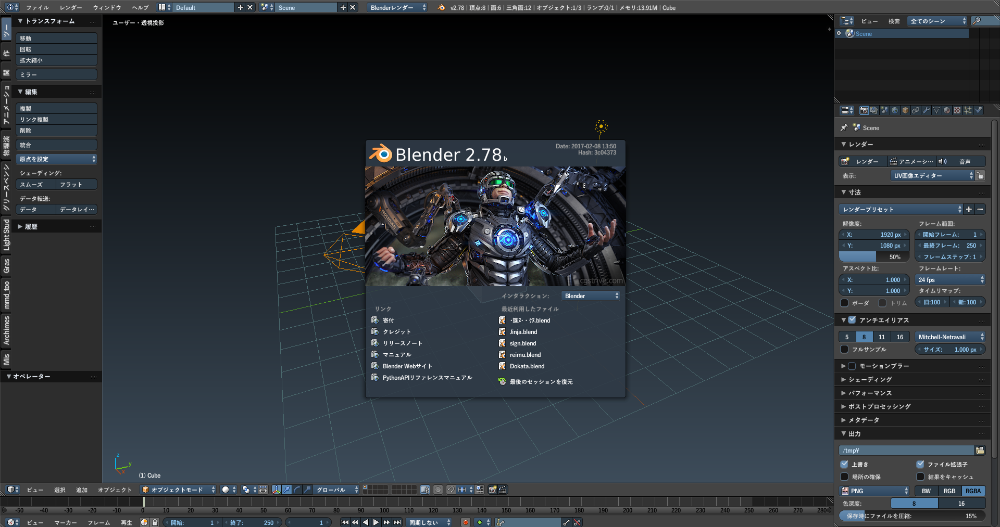
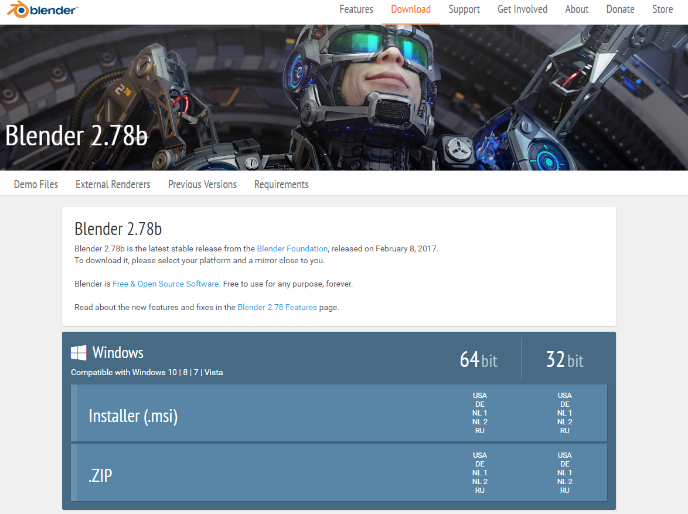
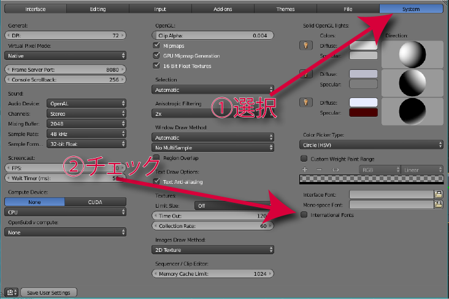

# Blenderのインストール

 

!!! warning
    このテキストは2017年4月に書かれたテキストをWeb用に変換したものです

本章では以下の内容を学習します。

 * Blenderとは
 * Blenderのインストール方法
 * UIの日本語化と初期設定

## Blenderとは何か？

Blenderとは有志によってオープンソースで開発されている、**無償で利用できる**3DCGソフトです。様々な機能を有しておりモデリングはもちろん、アニメーションやレンダリング、物理演算によるシミュレーション
など3DCGに関するあらゆる機能が詰まった統合型のソフトであり、ソフト単体での利用のほかに他のツールへの素材開発(UnityやMMDなど)
など様々な用途で利用されています。さらにマルチプラットフォーム対応のソフトであるのでWindows/Mac/LinuxなどOSを問わず利用できる点も大きな強みです。

拡張機能も柔軟であるところも特徴です。Pythonで書かれたスクリプトを実行することで煩雑な行動を簡略化できたり、MMDで使えるように出力できたりなどが容易に行えます。
Blenderは無料であるので、ユーザー数も多くスクリプトもそれだけ多く充実しています。

## Blenderのインストールと初期設定

Blenderのダウンロードページ(https://www.blender.org/download/ )より、使用しているOSと対応したものをダウンロードします。Windowsの場合はインストーラ版も利用できます(どちらでもよいです)。
ダウンロードしたら解凍(インストーラ版は実行)し、そのフォルダからblender.exeを選択し起動します。

起動したらまずはUIを日本語化しましょう。画面上部の[file]から[User Preferences...]を選択し、環境設定画面を開きます。上部から[System]を選択し、下部の[International Fonts]にチェックを入れ
Languageから日本語を選択し、[Interfaces][Tooltips][New Data]の3つのボタンを押下します。その後、画面左下の[ユーザー設定の保存]をクリックし設定を適用します。

また、Blenderでのオブジェクトの選択は初期設定では右クリックで行います。もしこの操作に慣れない場合は[入力]から選択:より[左]を選択することで左クリックでオブジェクトを選択できるようにすることも可能です。
他にオススメの初期設定としては[インタフェース]の**マウスの位置にズーム**と**3ボタンマウスを再現**にチェックを入れます。前者は拡大中心は視点の中心ではなくマウスの中心にします。後者は後述するマウスの中ボタンを
必要とする操作をAlt+左クリックで代用できるようになります。
