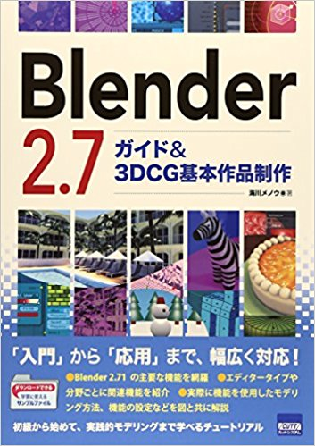
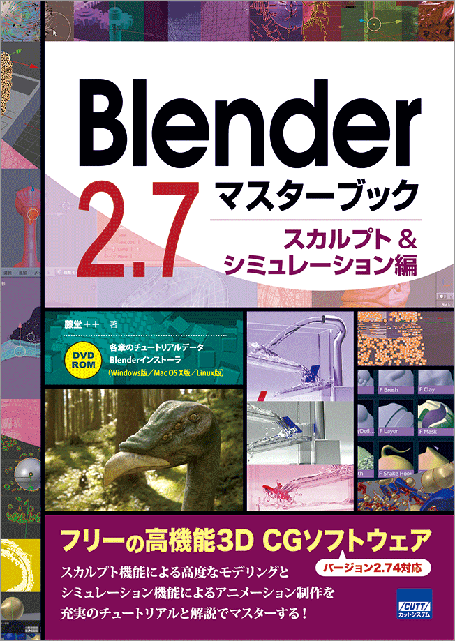
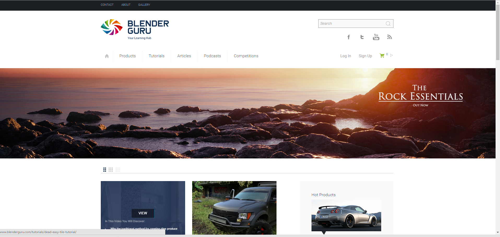
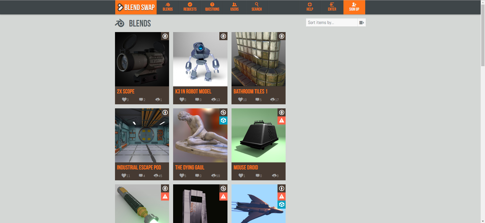

# おまけ さらなる高みを目指して

 

!!! warning
    このテキストは2017年4月に書かれたテキストをWeb用に変換したものです

簡単なシーン制作でしたが、案外覚えることがたくさんだったと感じたのではないでしょうか。

ここで、これから独学でBlenderを極めたい人向けにいくつかの書籍やリンクを紹介いたします

## さらなる一歩を踏み出すのに役立つ書籍 3選

### 1 Blender 2.7 ガイド&3DCG基本作品制作

ISBN:978-4877833589

Blenderの機能を包括的に解説した説明書です。今講習会では時間の関係上あまり触れることのできなかったことなども詳しく載っています。
入門書としては情報が一貫していないため若干不向きですが一連の操作を習得した後に見ると大きく知識を増やすことができる一冊です。

### 2 Blender 2.7マスターブック スカルプト&シミュレーション

ISBN:978-4877833626

Blenderの機能のうち物理演算とスカルプトについて詳説した本です。マスターブックと銘打っているとおり
これらの全機能を細かく解説しています。スカルプトとは、感覚的に作りたい作品を粘土のように造形できる機能です。
ポリゴンモデリングでは作りにくいようなオブジェクトをある程度簡単に作ることができます。

### 3 MikuMikuDanceキャラクターモデルメイキング講座

ISBN:978-4798140407

MMDに特化したキャラクターメイキングをするために必読の本。Blenderだけでなくpmx形式で出力後のpmxEditorの解説も細かく載っているため
自作のモデルをMMDで動かすにはこの一冊を持っておけば安心です。タイトルにMMDと銘打っていますが中身は98%Blenderの解説です。
MMDの使い方が学べるわけではありませんのでそこだけ注意が必要です

## 3-2 さらなる知識を得るために役立つサイト 3選

Blenderは無料で使用できるソフトウェア故、ウェブ上に良質なチュートリアルサイトが多数転がっています。

### 1 Blender Guru

URL:http://www.blenderguru.com/

多くの解説動画が無料で掲載されているうえ、一本一本の濃度が濃いといういいこと尽くめのサイト。
当サークルのパンフレットにもある月と地球の写真もこのサイトのチュートリアルを基に作成しました。

また、多数のチュートリアル動画を投稿しているAndrew Priceさんが運営しているサイトPoliigon(https://www.poliigon.com/)
もオススメです。無料では制限がありますが、高解像度でなおかつノーマルマップやバンプマップなどを多数兼ね備えたテクスチャを入手できます。

### 2 Blend Swap

URL:http://www.blendswap.com/

Blenderを用いて作成された作品を公開する場。Blendファイルが公開されているのでそれをダウンロードして参考にするのもよいし、Creative Commonsが記載されているので
それを遵守すれば自分の作品の一部として流用することも可能です。

### 3 プチ3DCGモデラーの毎日モデリング

URL:http://ch.nicovideo.jp/Arasen

Blenderの物理演算やアドオンの解説など幅広く解説している。また、講座的なページのほかにもたとえば今期のアニメである「けものフレンズ」の
3DCG屋から見た発見などの息抜き的コラムも充実しています。

何よりも日本語なのがありがたいです。
