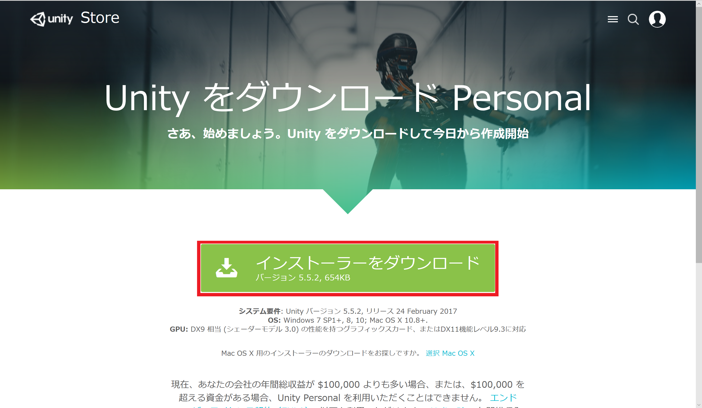

# Unityでゲーム制作をする準備

 

!!! warning
    このテキストは2017年4月に書かれたテキストをWeb用に変換したものです

本章では以下の内容を学習します。

 * Unityのダウンロード方法
 * ゲームの作成方法
 * Unityエディターの使い方

## Unityをダウンロードしよう

まずは[Unityのダウンロードページ](https://unity3d.com/jp/get-unity/download )を開きましょう。

以下のようなのページが開けていたら大丈夫です。

さて、上図の赤枠のように **「Unityを選択・ダウンロード」**をクリックしてください。
その後、下図のように**UnityPersonalの「今すぐダウンロード」**を選択しましょう。

そして下図のように**「インストーラをダウンロード」**をクリックします。

それではダウンロードしたファイルを実行しましょう。

下図のチェックボックスはインストール内容を決めるものです。
上の3つは基本的にチェックをつけておきましょう。
6つ目以降はビルドサポートです。
自分が制作したいプラットフォームを選択しましょう。

## ゲームを作成しよう
ダウンロードが完了したら、新規ゲームを作ってみましょう。以下の手順に従ってゲームを作成してください。

 Unityを立ち上げ、「Projects」を選択し、「new」をクリック

 プロジェクトの詳細を入力し、「Create project」をクリック

今回は「Project name」に「AthleticGame」と入力し、モードは3Dにします。

## Unityエディターの操作画面の基礎知識

さて、ゲームの作成が完了すると下図のようなエディター画面が表示されます。

詳しい使い方は作業をしながら学んでいきますので、まずはどこに何があるのか覚えましょう。

### Scene(シーン)ビュー
シーンビューには、背景、キャラクター、カメラ、ライトなどのゲーム要素(ゲームオブジェクト)が示されています。それらを選択、移動することでゲームオブジェクトの位置関係を変更することができます。

### Hierarchy(ヒエラルキー)ビュー
シーン上に置かれている全てのゲームオブジェクトが表示されます。階層構造にするなどの編集もここで行います。

### Project(プロジェクト)ビュー
プロジェクトにインポートされている画像やオーディオ、3Dモデル、プログラムなどすべてのファイル(アセット)が表示されます。

### Inspector(インスペクター)ビュー
選択したオブジェクトが持つ、要素や設定(コンポーネント)を確認、編集することができます。
コンポーネントには、位置や回転、大きさを表すTransformや、物理的な挙動を行わせるRigidbody、プログラム、オーディオなどが含まれます。
コンポーネントはドラマや映画で言う台本だと考えてもらっても構いません。

### Game(ゲーム)ビュー
作成しているゲームのプレビューを表示します。現在のゲームがどのように動くのか、バグはないかなどの確認のために使用します。プレビュー中に行った変更はプレイ状態を解除すると元に戻されてしまうので注意しましょう。

### Preview(プレビュー)パネル
ゲームプレビューの制御を行います。左から順にプレイ、ポーズ、ステップです。プレイをクリックすると、ゲームビューでプレビューが再生されます。もう一度クリックすることで停止することができます。ポーズをクリックすると一時停止します。ステップをクリックするとゲームをコマ送りにして確認することができます。

### Console(コンソール)ビュー
メッセージ、警告、エラーを表示します。プレビュー中に発見したバグの解決に役立ちます。

### Layout(レイアウト)メニュー
エディターのレイアウトを変更できます。あらかじめ、用意されているレイアウトを利用することもできますが、自分で使いやすいレイアウトに編集することもできます。レイアウトの編集は各ビュー左上部のタブを好きな場所までドラッグすることでできます。本書では説明の都合上、オリジナルのレイアウトを使用していることに注意してください。
