# Stage1

<span id="est"  class="80"></span>

<br>

!!! warning
    このテキストは2017年4月に書かれたテキストをWeb用に変換したものです

それではいよいよゲームを作っていきます。本章では以下の内容を学習します。

 * 標準の3Dオブジェクトの配置方法
 * 物理的挙動の反映
 * 入力を受け取る


## 標準で用意されている3Dオブジェクトを配置しよう

下図のようにヒエラルキービューの左上にある **「Create」->「3D Object」->「Sphere」** を選択してください。
すると、ヒエラルキービュー上に「Sphere」が生成されます。
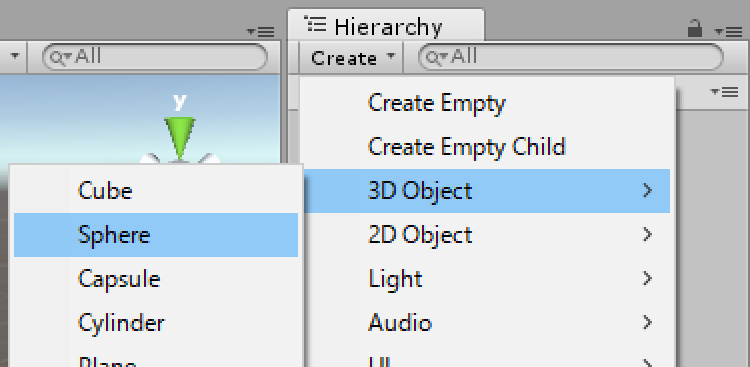

それではインスペクタービューを見てください。
まずは下図のように赤枠部分を編集してください。

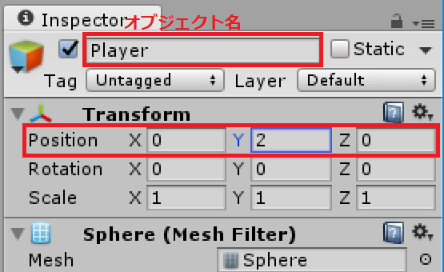

まず、一つ目の赤枠はゲームオブジェクトの名前です。
次に二つ目はゲームオブジェクトの位置、回転、大きさを示したTransformコンポーネントです。それぞれ順に「Position」、「Rotation」、「Scale」が対応しています。
生成したボールはプレイヤーとして操作できるものにしていきます。

同様にして、**「Create」->「3D Object」->「Cube」**を選択し、オブジェクト名とTransformを下表のように変更してください。

|変更箇所|変更内容|
|:-:|:-:|
|オブジェクト名|NormalRoad|
|Position|(0, 0, 0)|
|Rotation|(0, 0, 0)|
|Scale|(3, 1, 10)|

最終的に下図のように配置された状態にしましょう。

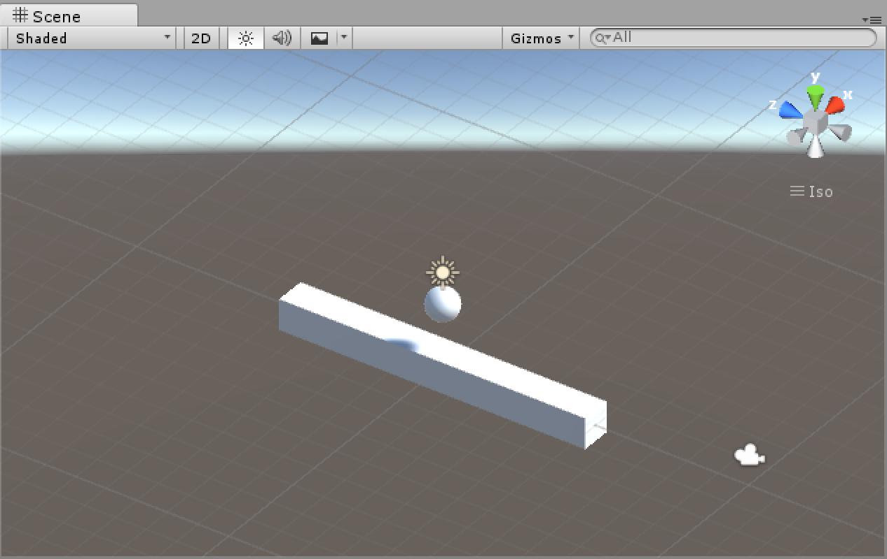

さて、ここで一度保存をしておきましょう。
下図のようにプロジェクトビュー上で **右クリック->「Create」->「Folder」** を選択し、名前を **「Scenes」** にしましょう。
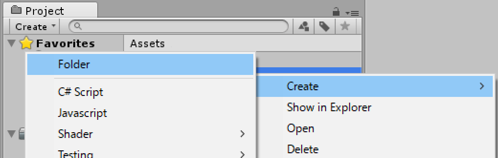

フォルダーができたら++ctrl+s++でシーンを保存します。下図のように保存先は先ほど作成したフォルダーです。名前は**「Stage1」**としましょう。
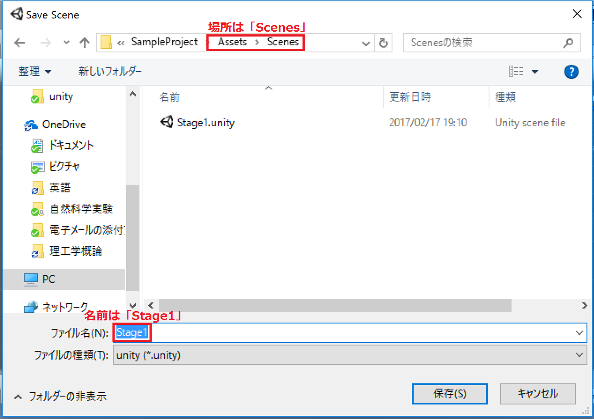

ここまでできたら、ゲームを再生してみてください。
プレビューパネルの再生ボタンをクリックしましょう。

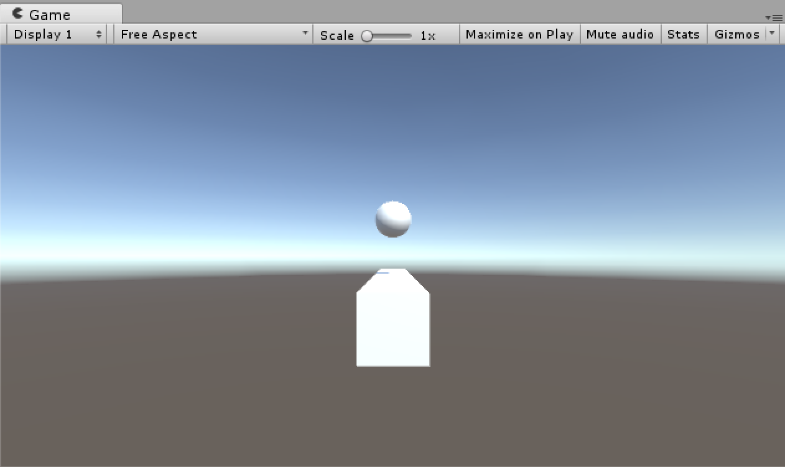

上図のように全く動きません。
これは、Playerに重力が反映されていないためです。
次節ではこの方法を学んでいきましょう。

## 物理的挙動を反映させよう

### PlayerにRigidbodyコンポーネントを追加する

力学的な挙動をゲームオブジェクトに反映させるためにはそのオブジェクトにRigidbodyコンポーネントを追加する必要があります。
**「ヒエラルキービューでPlayer」->「インスペクタービューの一番下にあるAdd Component」->「Physics」->「Rigidbody」**を選択してください。
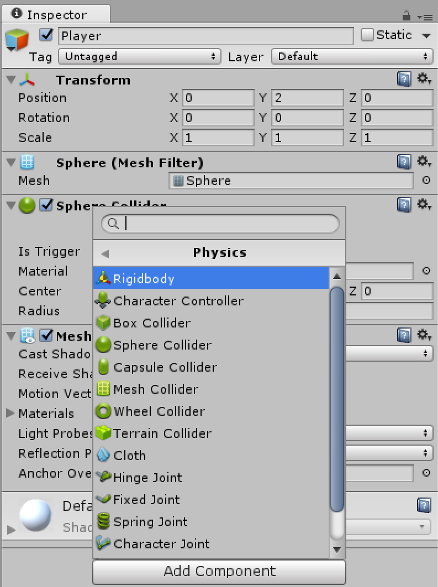

インスペクタービュー上にRigidbodyが追加されていることを確認してください。
また、**Rigidbodyコンポーネントの「Use Gravity」にチェックがついていることを確認してください**。
その後ゲームを再生してみましょう。PlayerがNormalRoadに落下することがわかると思います。

ここで、二つのオブジェクトが衝突したのはRigidbodyを追加したからだ、というわけではありません。
これはColliderコンポーネントが追加されているためです。

### Collider

Colliderとはゲームオブジェクト同士が接触したかどうかを判定するコンポーネントです。
作成したゲームオブジェクトを確認してみると、PlayerにはSphere Colliderコンポーネントが、
NormalRoadにはBox Colliderコンポーネントがそれぞれアタッチされています。
試に以下のように**PlayerのSphere Colliderコンポーネントの「Radius」を1に変更し**、ゲームを再生してください。

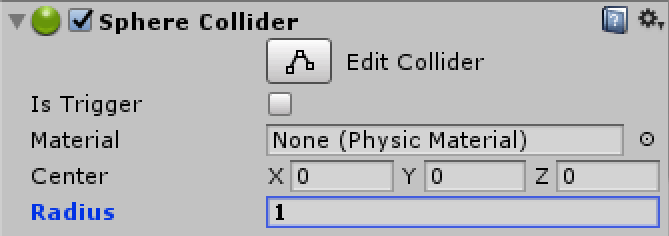

Playerが以下のように少し浮いたところで静止します。

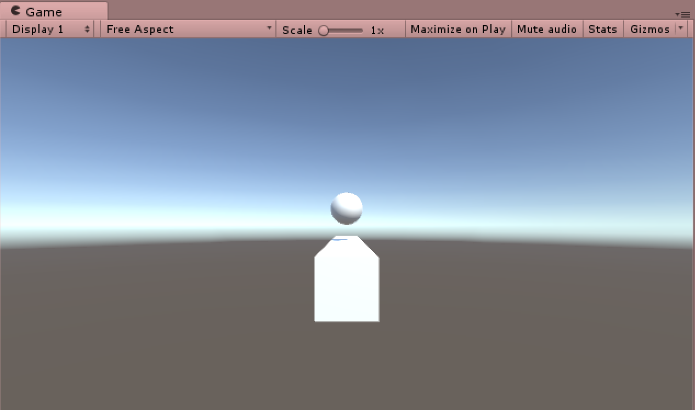

つまり、Colliderと見た目は必ずしも一致しないのです。
実験が終わったところで、**「Radius」を0.5に戻しておきましょう**。

いくら物理的な挙動をしても、操作ができなければゲームにはなりませんよね。
次節ではその方法を学んでいきます。

## Playerを動かそう
Playerを操作するためには以下の過程を踏む必要があります。

 1. キーボードの入力を受け取る。
 2. 入力に従って、適切な動作をPlayerに与える。

キーボードの入力を受け取るためには、スクリプトを書いていく必要があります。
まずはUnityでのスクリプトがどんなものか見ていきましょう。

### フレームを知ろう

スクリプトを書くにあたって、まずフレームについて理解しなければなりません。
パラパラ漫画を想像してください。
パラパラ漫画では短時間の間に何枚もページをめくってアニメーションを作っていますね。
Unityでも同じようにしてゲームを描写しており、パラパラ漫画でいう一枚一枚のページが1フレームに当たります。
ただし、Unityでは操作によって描写は変わるので、あらかじめ保存された画像を切り替えているわけではなく、毎時間画像を作成していきます。
この処理をレンダリングといいます。
このように、リアルタイムで演算や描画が行われているため、PCの環境によって1フレームあたりの時間はリアルタイムで変更してしまいます。
この時間を表す指標としてよく使用されるのが1秒間当たりのフレーム数、すなわちFPS(Frame Per Second)です。
FPSが大きいほど滑らかな映像となり、小さいほどカクカクなものとなります。

### StartメソッドとUpdateメソッド
まずはスクリプトを作成していきましょう。**「プロジェクトビュー上で右クリック」->「Create」->「Folder」**を選択し、
フォルダー名を**「Scripts」**とします。

そしてScriptsフォルダーを開き、下図のように、
**「右クリック」->「Create」->「C# Script」**を選択し、名前を**「Sample」**とします。
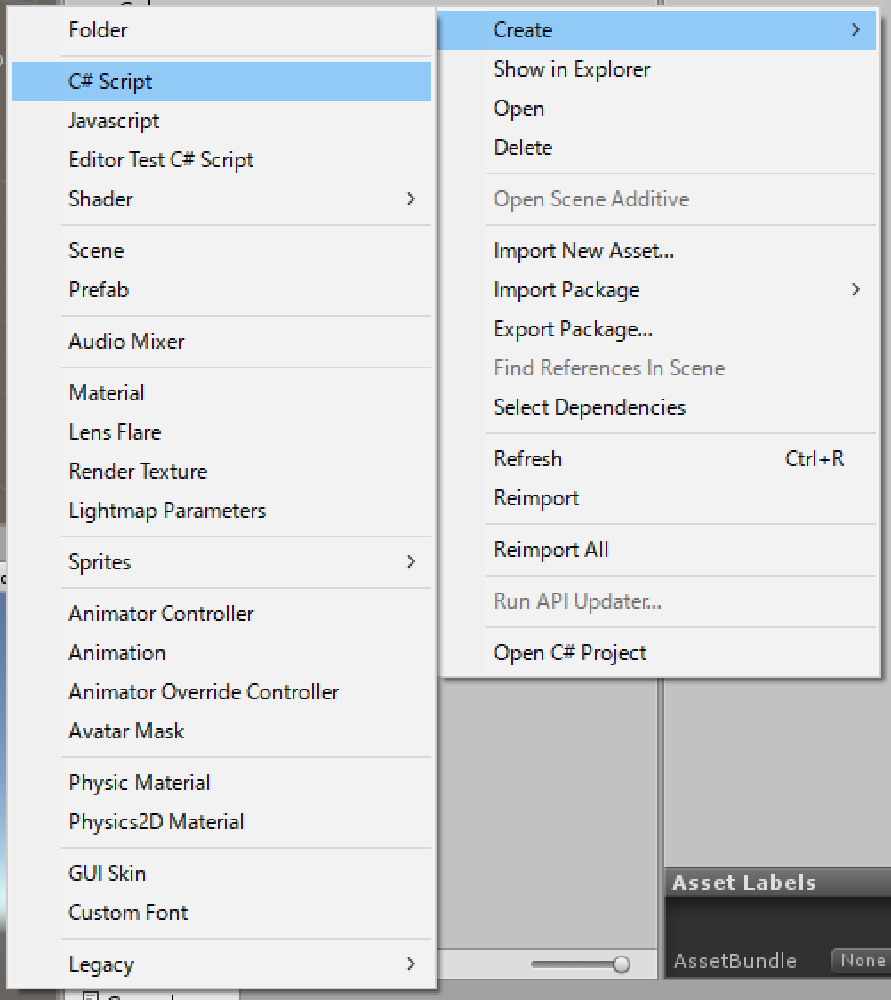

作成が終わったら、スクリプトを開き、中身を以下のように編集しましょう。
``` c# hl_lines="7 9 13" linenums="1"
using UnityEngine;
using System.Collections;

public class Sample : MonoBehaviour {

	// Use this for initialization
	void Start ()
    {
        print("Start");
	}

	// Update is called once per frame
	void Update ()
    {
        print("Update");
	}
}
```

入力が終わったら++ctrl+s++で保存しましょう。
さて、各プログラムの説明は後にすることにして、まずは動作を確認してみましょう。以下の図のように、
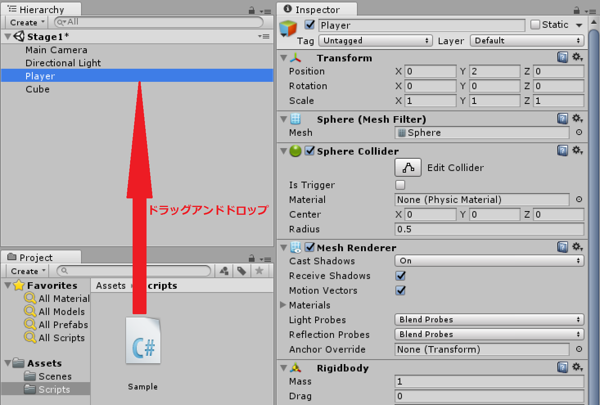
**Sample.csをヒエラルキービュー上のPlayerへドラッグアンドドロップ**しましょう。

Playerのインスペクタービューに「Sample(Script)」というコンポーネントが表示されていることを確認してください。
それでは、ゲームを再生してみましょう。
コンソールビュー上に以下の図のようなメッセージが表示されていたら成功です。
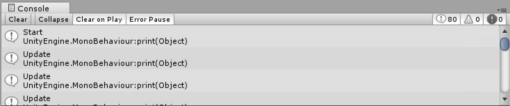
表示されたメッセージを一番上までさかのぼり確認すると、はじめにStartが表示され、その後Updateが沢山書かれています。
(バージョンによって多少表示が異なります。)

それでは、コードの解説をしていきます。
まず、1~4行はおまじないだと考えてください。
<!-- hl_lines="1 3" linenums="2" -->

**:fa-circle: 7行目**

``` c# linenums="7"
  	void Start () {
```
これはStartメソッドといい、以下のように記述して使用します。
``` c#
  void Start ()
  {
        //ここに実行したい内容を記述する。
  }
```
Startメソッドはこのコンポーネントが生成されたとき、後述するUpdateメソッドや他の関数よりも先に実行されます。

**:fa-circle: 9行目**

``` c# linenums="9"
          print("Start");
```
これはprintメソッドといいます。
`print(Object)`のように記述することで、コンソール上に()内のObjectを表示してくれます。
このメソッドはゲームの動作には全く影響しません。
バグの原因を探ったり、ゲームが正しく動作しているか確認したりするために使用します。

**:fa-circle: 13行目**

``` c# linenums="13"
  	void Update ()
```
これはUpdateメソッドといい、以下のように記述して使用します。
``` c#
  void Update()
  {
        //ここに実行したい内容を記述する。
  }
```
このUpdateメソッドは毎フレームごとに実行されます。
ゲームでの主な処理はこのUpdateメソッドの中に書いていきます。

Sampleコンポーネントはこの先使用しないのでPlayerから取り除いていきます。
下図のように、**「Sampleコンポーネントの上部で右クリック」->「Remove　Component」**を選択します。
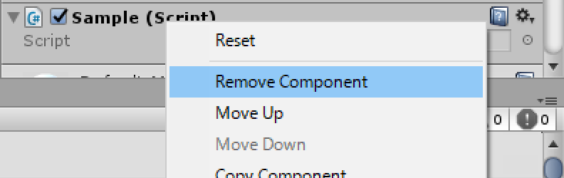

### キーボードの入力を受け取る
ここからはPlayerのスクリプトを作成してしていきます。
クラスやメソッドなどが沢山でてきますが、よくわからない場合は流し流し読んでください。
今回はキーボードから矢印キーの入力を受け取り、それに応じてPlayerに力を加えます。すなわち、Rigidbodyコンポーネントに力を加えるのです。
**「プロジェクトビュー上で右クリック」->「Create」->「C# Script」** を選択し、名前を **PlayerController」** とします。
それでは、スクリプトを開き、`public class PlayerController : MonoBehaviour {　}`の中身を以下のように編集しましょう。

``` c# hl_lines="1 3 18" linenums="1"
  [SerializeField] int speed;

  Rigidbody playerRigidbody;
  float x = 0f;
  float z = 0f;

  void Start()
  {
      playerRigidbody = GetComponent<Rigidbody>();
  }

  void Update()
  {
      x = Input.GetAxis("Horizontal");
      z = Input.GetAxis("Vertical");
  }

  void FixedUpdate()
  {
      Vector3 direction = new Vector3(x, 0, z);
      playerRigidbody.AddForce(direction.normalized * speed);
  }
```
入力が終わったら++ctrl+s++で保存しましょう。
それでは順番に見ていきましょう。

**:fa-circle: 1行目**

``` c# linenums="1"
     [SerializeField] int speed;
```
これはPlayerの移動速度を自由に変更するために定義しました。宣言の頭に`[SerializeField]`をつけることによってインスペクター上で値を変化させることができます。
実際に確認してみましょう。
**PlayerController.csをヒエラルキービュー上のPlayerにドラッグアンドドロップ**してください。
次に、インスペクタービューを見てください。
以下の図のように`speed`を入力するウィンドウが作成されているはずです。
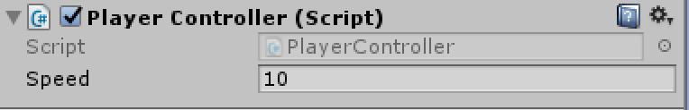

ここには**10を入力しておきましょう**。

**:fa-circle: 3行目**

``` c# linenums="3"
  Rigidbody playerRigidbody;
```
インスペクター上のコンポーネントは`int`や`string`などと同様に、型として宣言できます。
今回は`Rigidbody`コンポーネントに力を加えることで移動を実現するので`Rigidbody`型の変数を宣言します。
ちなみに、本書ではゲームオブジェクトにアタッチされているクラス(正確にはインスタンス)のことをコンポーネントと呼んでいます。

**:fa-circle: 4-5行目**

``` c# linenums="4"
  float x = 0f;
  float z = 0f;
```

移動の入力を受け取る変数を宣言しました。
入力結果のうち進行方向に対して平行成分を`x`に、垂直成分を`z`にそれぞれ代入します。

**:fa-circle: 7-10行目**

``` c# linenums="7"
  void Start()
  {
      playerRigidbody = GetComponent<Rigidbody>();
  }
```

ゲームオブジェクトを生成したと同時に`Player`の`Rigidbody`コンポーネントを取得します。
さて、6行目を見てください。
`GetComponent<>()`はそのゲームオブジェクトについているコンポーネントを<>内に記述することで取得することができるメソッドです。
このようにして、`Player`についている`Rigidbody`コンポーネントを変数`playerRigidbody`に代入することができました。

**:fa-circle: 12-16行目**

``` c# linenums="12"
  void Update()
  {
      x = Input.GetAxis("Horizontal");
      z = Input.GetAxis("Vertical");
  }
```

毎フレームキーボードからの入力を受け取って先ほど宣言したx、zに代入しています。
Inputはプレイヤーからの入力を扱うクラスです。
`GetAxis("Horizontal")`は矢印キーの入力を左から右にかけてそのボタンの押し具合によって-1~1の値をとります。
つまり左が押されていればその値は-1に、右が押されていればその値は1、どちらも押されていなければ0というようになります。
`GetAxis("Vertical")`は`GetAxis("Horizontal")`とは違い、上下キーに対応しています。
`Input.GetAxis(name)`によって`Input`クラス内の`GetAxis`メソッドを使用することができます。

**:fa-circle: 18-22行目**

``` c# linenums="18"
  void FixedUpdate()
  {
      Vector3 direction = new Vector3(x, 0, z);
      playerRigidbody.AddForce(direction.normalized * speed);
  }
```

ここには`Rigidbody`コンポーネントに力を加えるコードが書かれています。
``` c# linenums="18"
    void FixedUpdate()
```
この`FixedUpdate`メソッドはFPSに左右されず、一定の間隔で呼ばれます。
今回のように力を加えたり、物体を移動させたりする場合は`Update`メソッドではなく、`FixedUpdate`メソッド内に記述するようにしましょう。
``` c# linenums="20"
    Vector3 direction = new Vector3(x, 0, z);
```
そして、20行目で三次元空間に存在する`Player`に力を加えるために、受け取った入力を三次元のベクトルにしています。
`Vector3`は三次元のベクトルを入れる型で、今回はdirectionという名前の変数にしました。
新しく`Vector3`を作る場合は上のコードの`new Vector3(x, y, z)`のように代入します。
``` c# linenums="21"
    playerRigidbody.AddForce(direction.normalized * speed);
```
`Rigidbody`コンポーネントの中には、力を加える関数が存在します。
それが`AddForce()`です。
`rigidbody.AddForce(Vector3)`で`rigidbody`に指定した向きで力を加えることができます。
この`rigidbody`には力を加えたいゲームオブジェクトの`Rigidbody`コンポーネントを持った変数を入れてやります。
今回は`Player`に力を加えるので、先ほど`Player`の`Rigidbody`コンポーネントを代入した`playerRigidbody`を入れます。

また、`vector3.normalized`によって、任意の`vector3`を単位ベクトルに直すことができます。
この場合、`vector3.normalized`を`direction.normalized`にすることで、`direction`方向の単位ベクトルを取り出しています。
このようにしなければ例えば↑キーと→キーを同時に押し込んだ際、`direction`は(1, 0, 1)となり大きさが約1.4になってしまうので、上下左右に進むときと比べ速くなってしまいます。

そして最後に先ほど作成した`Player`の速さをかけてやります。
こうすることで、`speed`の値を変えることによって任意の大きさの力を`Player`に与えることができます。

## Stage1の状態を確認しよう

ここまで完成したら、++ctrl+s++でゲームを保存しましょう。
それではゲームを再生してみましょう。
矢印キーを操作することでPlayerを動かせるはずです。

以上でこの章は終了となります。
次章はColliderを応用してPlayerのジャンプを実装していきます。
