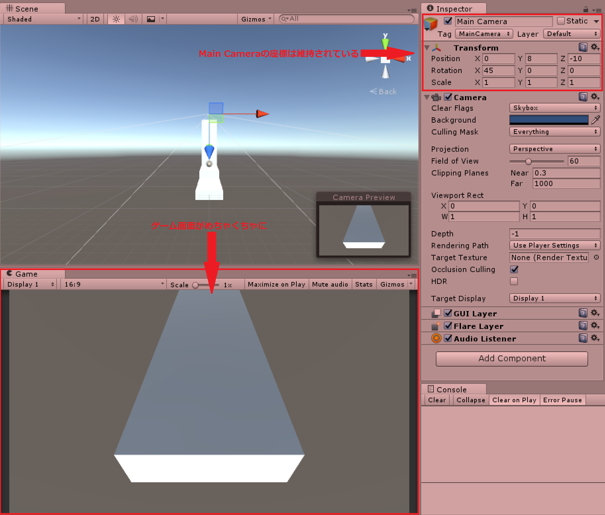

# Stage2

<span id="est"  class="170"></span>

<br>

!!! warning
    このテキストは2017年4月に書かれたテキストをWeb用に変換したものです

今回は新しいシーンを作って前回学んだRigidbodyやColliderを応用していきます。
この章では以下の内容を学習していきます。

 * Prefab化
 * スクリプト上でColliderの衝突判定を取得する方法
 * Transformをスクリプトで変更する方法

## 新しいシーンを作ろう
それでは、まず新しいシーンを作りましょう。
下図のように、**「File」->「New Scene」**を選択してください。


何も置かれていない初期状態のシーンが表示されていたら大丈夫です。

## prefab化しよう
さて、ここから新しいステージを作っていくわけですが、前章のような設定をいちいち行うのは大変です。
Playerはステージに関係なく使い続けたいゲームオブジェクトです。
Unityではこういった何度も使うゲームオブジェクトを再利用できるようにする仕組みがあります。
それがprefabです。

まずは現在のシーンを保存しましょう。
**「Ctrl+S」->「Scenes」**を選択します。
名前は**「Stage2」**としましょう。
以下の図のようになっていたら大丈夫です。


つづいて、**「プロジェクトビューでScenes」->「Stage1」**を選択してください。
前章で作成したシーンが表示されます。
それでは、prefab化していきます。
**「プロジェクトビューのAssetsフォルダ上で右クリック」->「Create」->「Folder」**を選択し、フォルダーを作ります。
名前を**「Prefabs」**とします。
次に、下図のように**Prefabsフォルダーを開いた状態で、ヒエラルキービューからプロジェクトビューへとPlayerをドラッグアンドドロップ**してください。


すると、ヒエラルキービュー上の「Player」の文字が青く変わり、プロジェクトビュー上にPlayerが出現します。


Playerのprefab化が完了したら、NormalRoadもprefab化しておきましょう。

それではシーンを保存してStage2を開きましょう。
下図のように**プロジェクトビューでPrefasフォルダーからヒエラルキービューへとPlayerをドラッグアンドドロップ**してください。


シーンにPlayerが配置されたと思います。
さらに、Stage1で行った設定をそのまま引き継いでいます。
同様にしてNormalRoadもシーンに配置しましょう。
これで、Stage1と全く同じシーンができました。

## ゲームオブジェクトを複製しよう
**ヒエラルキービューでNormalRoadを選択した状態にしてください。**
ヒエラルキービュー上の**NormalRoad**が青くなっている状態になれば大丈夫です。
つづいて++ctrl+d++を押してください。
するとヒエラルキービューに「NormalRoad (1)」というゲームオブジェクトが生成されると思います。
その後NormalRoad (1)のTransformを以下のように編集してください。

|変更箇所	|変更内容|
|:-:|:-:|
|Position|	(0, 1, 10)|

## ジャンプを実装する
さて、前節で作成したステージの端まで進むには段差を飛び越える必要がありますね。
この節では、スペースボタンが押されたらジャンプをするスクリプトを書いていきましょう。

まずは、前回学んだことを生かしてPlayerController.csを以下のように編集してみましょう。

<!-- hl_lines="1 3" linenums="2" -->

``` c# linenums="1"
  //…省略
  float x = 0f;
  float y = 0f;//←追加
  float z = 0f;

  //…省略

  void Update()
  {
      x = Input.GetAxis("Horizontal");
      y = Input.GetAxis("Jump");//←追加
      z = Input.GetAxis("Vertical");
  }

  void FixedUpdate()
  {
      Vector3 direction = new Vector3(x, y, z);//←編集
      playerRigidbody.AddForce(direction.normalized * speed);
  }
```
3行目に上方向の入力結果を代入する変数を宣言しました。
11行目に`Input.GetAxis("Jump")`とありますが、"Jump"は++space++に対応したものです。
++space++の押し具合によって0~1の値をとります。
これを6行目の`direction`に加えてやることで、y軸方向に力を与えジャンプさせようとしているのです。
それでは++ctrl+s++で保存し、ゲームを再生してみましょう。

++space++を押し続けると少しずつPlayerが上昇していくことがわかります。


しかし、これでは「跳ぶ」というより「飛ぶ」といった感じですね。
原因を考えていきましょう。
まず、ゆっくりと飛んだ理由は力不足によるものです。
Playerには重力が働いているため、y軸方向に移動するためにはx、z軸方向に比べ大きな力が必要です。
また、++space++を押し続けて上昇したのは、`FixedUpdate`メソッドの特徴です。
現実では、ジャンプをするとき地面を蹴る瞬間にしか力はかかりません。
しかしこのメソッドは一定間隔で呼ばれてしまうため、++space++を押している間はy軸方向に力が加わり続けてしまうのです。

この節ではこの解決方法を学んでいきます。

### ボタンを押したかどうか判定する
まずは、ボタンを押した瞬間にだけ跳ぶようにしましょう。
実は`Input`クラスにはキーを押した瞬間にのみ、処理を行うメソッドがあります。
それは`GetButtonDown`メソッドです。
これは特定のボタンを押した瞬間に`true`を返し、それ以外のときは`false`を返す`bool`型のメソッドです。
GetAxisのように押具合を値として返してくれるわけではないので、同じような使い方ができないことに注意してください。
では、`PlayerController.cs`の`public class PlayerController : MonoBehaviour { }`内を以下のように編集してください。

``` c# linenums="1"
Rigidbody playerRigidbody;
[SerializeField] int speed;
[SerializeField] int power = 5;//←追加

//…省略

void Update()
{
    x = Input.GetAxis("Horizontal");
    z = Input.GetAxis("Vertical");//←編集
    if (Input.GetButtonDown("Jump") == true)//←追加
    {
        y = power;
    }
    else
    {
        y = 0;
    }
}

void FixedUpdate()
{
    Vector3 direction = new Vector3(x, 0, z);//←編集
    playerRigidbody.AddForce(direction.normalized * speed);
    playerRigidbody.AddForce(0, y, 0, ForceMode.Impulse);
}
```

では順番に見ていきましょう。

** :fa-circle: 3行目 **

``` c# linenums="3"
  [SerializeField] int power = 5;
```
ジャンプをする力の大きさを定義しています。
このコードのように初期化をすることでインスペクタービュー上で初めから値が代入された状態を作ることができます。
後ほど説明する`ForceMode.Impulse`を考慮して、`speed`より値を小さくしています。

** :fa-circle: 9-10行目 **

``` c# linenums="9"
	x = Input.GetAxis("Horizontal");
	z = Input.GetAxis("Vertical");
```
先ほど編集した部分は使わないので上記のようにしておきましょう。

** :fa-circle: 11-18行目 **

``` c# linenums="11"
  if (Input.GetButtonDown("Jump") == true)
  {
      y = power;
  }
  else
  {
      y = 0;
  }
```
11行目では`if`文を使って、`Input.GetButtonDown("Jump")`が`true`になったとき、すなわち++space++を押したときのみ{ }内のプログラムを実行します。
else文も利用して押したときには`power`を、押されていないときには`0`をそれぞれ`y`に代入します。

** :fa-circle: 23行目 **

``` c# linenums="23"
    Vector3 direction = new Vector3(x, 0, z);
```

10行目と同様に先ほど編集した部分は使わないので上記のようにしておきましょう。


** :fa-circle: 25行目 **

``` c# linenums="25"
  playerRigidbody.AddForce(0, y, 0, ForceMode.Impulse);
```

実はこのように`AddForce`は`AddForce(x, y, z)`のようにして力を与えることもできます。
ところが、コードには四つ目の値がありますね。
この`ForceMode`は力の種類を表します。
`ForceMode.Impulse`は対象の`Rigidbody`の質量(Mass)使って瞬発的な力を加えます。
実はデフォルトでも`ForceMode`は設定されており、それは`ForceMode.Force`となります。
これは対象の質量を使用して、継続的に力を加え続けます。
同じ大きさの力でも`Impulse`は`Force`に比べ一瞬の力が大きくなります。

それでは++ctrl+s++でスクリプトを保存して、ゲームを再生しましょう。
確かに押し続けても上昇しなくなりましたが、何度も多段ジャンプできますね。

### Colliderに接触しているか判定する
さて、今度は床に乗っている間だけジャンプできるようにしましょう。
そのためにはPlayerがColliderに接触している間のみジャンプの入力を受け付けなければなりません。
まずは、PlayerController.csを以下のように編集してください。

``` c# linenums="1"
  //…省略
  bool isTouching;//←追加

  void Update()
  {
      x = Input.GetAxis("Horizontal");
      z = Input.GetAxis("Vertical");
      if (Input.GetButtonDown("Jump") && isTouching)//←編集
      {
          y = power;
      }
      else
      {
          y = 0;
      }
  }

  //…省略

  void OnCollisionEnter()//←追加
  {
      isTouching = true;
  }

  void OnCollisionExit()//←追加
  {
      isTouching = false;
  }
```

では説明していきます。

** :fa-circle: 2行目 **

``` c# linenums="2"
  bool isTouching;
```

床に接触しているか判定をこの変数に入れることにします。
もし、触れていたら`true`を、触れていなければ`false`を代入します。

** :fa-circle: 8行目 **

``` c# linenums="8"
 if (Input.GetButtonDown("Jump") && isTouching)
```
まず、今までは`Input.GetButtonDown("Jump")==true`としていましたが、13行目のように書くこともできます。
理由は以下の通りです。
`Input.GetButtonDown("Jump")`は++space++が押されたときに`true`が返されます。
そしてif文の条件式は()内が`true`になればいいので、++space++が押されている時13行目は`if(true)`となり、条件式を通過するのです。
また、ジャンプの条件式に、床にふれていることを追加します。
つまり、`isTouching`が`true`になっていることを条件に追加します。

** :fa-circle: 20-23行目 **

``` c# linenums="20"
    void OnCollisionEnter()
    {
        isTouching = true;
    }
```

このメソッドは何か`Collider`に接触した瞬間に一回だけ呼ばれます。
22行目のように判定である`isTouching`を`true`にすることで床に触れていることを表します。
`OnCollisionEnter`は以下のように記述して使用します。
``` c#
void OnCollisionEnter(Collision collision)
{
    //ここに処理したいコードを記述する
}
```
このメソッドにある`collision`にはぶつかったオブジェクトが代入され、メソッド内で利用することができます。
今回のコードのように利用しないこともできます。

** :fa-circle: 25-28行目 **

``` c# linenums="25"
  void OnCollisionExit()
  {
      isTouching = false;
  }
```
このメソッドは`Collider`との接触が離れた瞬間に呼ばれます。
27行目のように判定である`isTouching`を`false`にすることで床から離れたことを表します。
`OnCollisionExit`は以下のように記述して使用します。

```c#
void OnCollisionExit(Collision collision)
{
    //ここに処理したいコードを記述する
}
```
このメソッドにある`collision`には離れたオブジェクトが代入され、メソッド内で利用することができます。
今回のコードのように利用しないこともできます。
これでジャンプの実装は完了です。
++ctrl+s++でスクリプトを保存したら、ゲームを再生させましょう。

### 仕様の確認
さて、このジャンプの実装ではある面白い仕様を持ちます。
**「ヒエラルキービューでCreate」->「3D Object」->「Cube」**を選択したください。
設定は以下の通りです。

|変更箇所|	変更内容|
|:-:|:-:|
|オブジェクト名|	KickWall|
|Position|	(0, 5.5, 15.5)|
|Scale|	(3, 10, 1)|

設定が完了したらゲームを再生しましょう。
そして、先ほど作成した`KickWall`に向かって、++space++を何度も押してください。

下図のように、`Player`が`KickWall`を上っていることに気が付きます。


これは、`OnCollisionStay`メソッドはステージの上面に限らずどの部分からでも、`Collider`に接触してさえいれば呼ばれるためです。

## カメラを追従させよう
そろそろ画面が見づらいですよね。
今度は画面を`Player`に追従させましょう。
現在ゲームビューに映し出されているプレイ画面はヒエラルキービューで「Main Camera」というカメラオブジェクトによって映し出されたものです。
この`Main Camera`の位置や角度を変更することで映し出される画面の位置や角度が変更します。

まずは、`Main Camera`を動かして`Player`がゲーム画面の中心に来るようにしましょう。
`Main Camera`の設定を以下のように変更してください。

|変更箇所	|変更内容|
|:--------:|:--:|
|Position|	(0, 10, -10)|
|Rotation|	(45, 0, 0)|

これで、`Player`が画面の中心に来ました。
ところがゲームを再生させ、`Player`を移動させてみると、下図のようにPlayerが移動してもついてきません。


カメラを追従させるさせる方法はいくつかありますがその最も簡単なものはPlayerとMain Cameraを階層構造にすることです。

### 階層構造
Unityにはゲームオブジェクト同士を親子関係で結び、階層構造をつくる機能があります。
この関係はヒエラルキービューで、子にしたいゲームオブジェクトを親にしたいゲームオブジェクトへとドラッグアンドドロップするだけで形成することができます。
Unityのゲームオブジェクトは親からの相対座標を`Transform`に保持しているため、子オブジェクトは親オブジェクトを基準として、移動・回転・拡大縮小するのです。
たとえば、親オブジェクトの位置が(1, 1, 1)、子オブジェクトの位置が(0, 1, 2)のとき、子オブジェクトの真の位置(ワールド座標)は(1, 2, 3)となります。

実際にやってみましょう。


下図のように**ヒエラルキービューで`Main Camera`を`Player`までドラッグアンドドロップしてください**。


`Main Camera`の`Transform`を見てください。下図のようにMain Cameraのy座標が10から8に変化したことがわかります。


これは、`Player`の座標が(0, 2, 0)だったため、ワールド座標で(0, 10, -10)である`Main Camera`の、`Player`からの相対座標は、(0, 8, -10)だからです。
こうすると`Main Camera`は`Player`からの相対位置を一定に保つように移動するため、ゲームを再生し`Player`を移動させても、常にこのTransformを維持し続けます。
試にゲームを再生させてみましょう。

下図のように、`Main Camera`の相対座標は維持されていますが、ゲーム画面が回転して、訳が分からなくなってしまっています。



これは、`Player`が移動する際に回転をしているためです。
これではゲームとして成り立ちませんね。
この方法は使えないので、下図のように、**Main CameraをPlayerの外にドラッグアンドドロップして、親子関係を解除しましょう**。
ドロップする際、青い横線が出ていることを確認してください。


### スクリプトで追従
親子関係ではうまくいかなかったので、スクリプトから追従させましょう。
前述したように、インスペクター上のコンポーネントは型としてスクリプトで扱えます。
`transform`型を利用して`Main Camera`を`Player`に追従させましょう。

まずは、**「プロジェクトビューでScriptsフォルダーを開く」->「Create」->「C# Scripts」**を選択してください。
名前は**「FollowCamera」**とします。
それではFollowCamera.csを開き、以下のように`public class FollowCamera : MonoBehaviour { }`の中身を編集してください。
``` c# linenums="1"
  [SerializeField] Transform target;
  Vector3 offset;

// Use this for initialization
void Start () {
      offset = target.position - transform.position;
}

// Update is called once per frame
void Update () {
      transform.position = target.position - offset;
}
```

順に見ていきます。

** :fa-circle: 1行目 **

``` c# linenums="1"
  [SerializeField] Transform target;
```
まず、`transform`型の変数を宣言しています。
ここには`Player`の`Transform`コンポーネントを代入しますが、`[SerializeField]`にしていることからわかるように、インスペクター上で代入を行おうと思います。
では、代入をしておきましょう。
++ctrl+s++でスクリプトを保存したら、**プロジェクトビューからFollowCamera.csをヒエラルキービュー上のMain Cameraまでドラッグアンドドロップしてください。**

つづいて、下図のように、**ヒエラルキービューでMain Cameraを選択した状態で、PlayerをインスペクターにあるFollowCameraのTargetまで、ドラッグアンドドロップしてください。**


これで完了です。

** :fa-circle: 2行目 **

``` c# linenums="2"
  Vector3 offset;
```

ここには初期状態での`Player`と`Main Camera`の相対座標を記録します。
こうすることで、`Main Camera`を`Player`と一定距離を保ちながら移動させることができます。

** :fa-circle: 6行目 **

``` c# linenums="6"
      offset = target.position - transform.position;
```

単純なベクトル計算によって`Player`と`Main Camera`の相対座標を計算しています。
実は、`Transform`コンポーネントは`transform`と入力することによって、`GetComponent<>()`などで取得せずとも使用することができます。
`transform.position`とすることで、このスクリプトをアタッチしているゲームオブジェクトの`Transform`コンポーネントの`Position`の値を`Vector3`型にして取り出せます。
`target.position`と書くことで、`target`に`Player`の`Transform`コンポーネントが代入されているため、その`Position`が取り出されます。

** :fa-circle: 10-12行目 **

``` c# linenums="10"
	void Update () {
	      transform.position = target.position - offset;
	}
```

毎フレームごとに`Main Camera`の`Position`に`Player`のポジションから相対座標を引いてやることで、`Main Camera`が移動すべき座標を指定しています。

### Main Cameraをprefab化しよう
`Main Camera`も`Player`や`NormalRoad`と同じように何度も利用したいのでprefab化しておきましょう。
**ヒエラルキービュー上のMain CameraをプロジェクトビューのPrefasフォルダーへとドラッグアンドドロップ**しましょう。
その後、++ctrl+s++でシーンを保存してください。

それではStage1にも追従する`Main Camera`を設置しておきましょう。
**プロジェクトビューのScenesフォルダーで、Stage1を選択しましょう**。
Stage1が開けたら、**ヒエラルキービュー上のMain Cameraを選択した状態でDelキーを押してください**。
元の`Main Camera`を消すことができたら、**プロジェクトビューのPrefasフォルダーから`Main Camera`をヒエラルキービューへとドラッグアンドドロップしましょう。**
そして、**インスペクターの`FollowCamera`の`Target`に`Player`を代入しておきましょう**。

## Stage2の状態を確認しよう
ここまで完成したら、Unityの画面に戻り、++ctrl+s++でゲームを保存しましょう。
それではゲームを再生してみましょう。
`Player`がどこに移動してもゲーム画面には常に`Player`が真ん中に映し出されているはずです。
